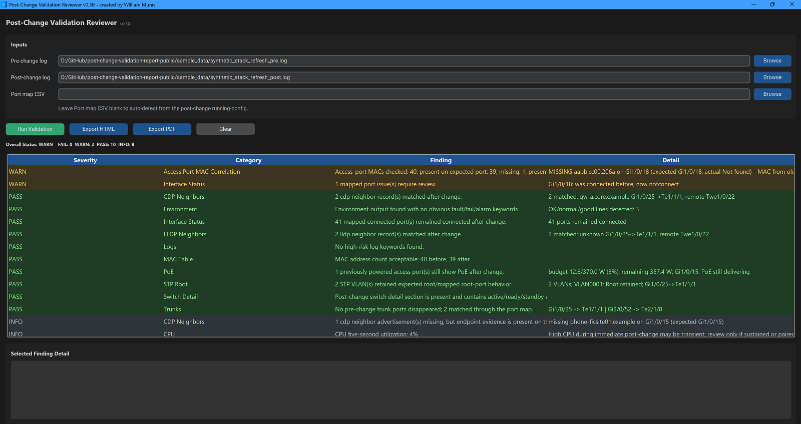

# Post Change Validation Tool

## Purpose

Post Change Validation Tool is a Python GUI application for reviewing pre-change and post-change Cisco switch-refresh command logs.

The tool compares command-output evidence, applies environment-aware port mapping, and generates operator-readable findings with `FAIL`, `WARN`, `PASS`, and `INFO` severity.

It is an offline review tool. It does not connect to devices or run commands.

An example of the report it produces can be found [here](https://github.com/wmmunn/post-change-validation-report-public/blob/main/sample_data/sample_report.pdf)).




## Supported Log Scope

This tool accepts **Cisco IOS and IOS-XE** command-output logs only. At file selection and before analysis, the reviewer checks the `show version` section for an IOS or IOS-XE software signature (for example `Cisco IOS XE Software, Version 17.09.04`).

**Not supported:** NX-OS, IOS-XR, and other Cisco OS families. Parsers and refresh assumptions in this tool target IOS/IOS-XE CLI formatting, interface naming, and command output shapes. Logs from other platforms are rejected with a blocking message rather than producing misleading findings.

See `docs/environment-assumptions.md` for additional scope notes.

## Entry Point

Launch the reviewer from the project root:

```text
python post_change_validation_reviewer.py
```

Core engine modules live under `src/`. The entry script imports analysis through the `src` package, for example `from src.post_change_validation_analysis import run_analysis`.

## Confirmed Inputs

- Pre-change command log text file.
- Post-change command log text file.
- Optional manual port-map CSV override.

The manual CSV override uses these columns:

- `old_port`
- `new_port`
- `role`
- `note`

If no CSV is provided, the tool attempts to auto-build an environment-specific port map from the post-change `show running-config` section.

## Confirmed Command Sections

The reviewer splits raw logs into command sections and recognizes normal prompt-prefixed command lines, bare `#show ...` and `>show ...` command lines, and common Cisco show abbreviations such as `sho inventory` or `sh int status`.

Source-confirmed command families include:

- `show interfaces status`
- `show interfaces trunk`
- `show cdp neighbors`
- `show lldp neighbors`
- `show mac address-table`
- `show logging`
- `show running-config`
- `show switch detail`
- `show spanning-tree root`
- `show spanning-tree summary`
- `show dot1x all summary`
- `show interfaces transceiver detail`
- `show environment all`
- `show power inline`
- `show version`
- `show processes cpu`
- `show inventory`

## Confirmed Outputs

- GUI finding table with severity, category, finding, and detail.
- Selected-finding detail pane.
- HTML report export.
- PDF report export when `reportlab` is installed.

Reports include:

- Overall status.
- Severity counts.
- Top-level status highlights for MAC correlation, PoE, neighbors, interface status, trunks, and STP root evidence.
- Neighbor highlights summarize CDP and LLDP separately with concise matched and MAC/PoE-cleared advertisement counts.
- If WARN/FAIL findings exist outside the top-card categories, reports show a `Review Required Outside Top Cards` strip directly under the severity counts.
- Report input metadata near the bottom of the report.
- Detailed findings.
- Color-coded access-port MAC correlation table when available.

## Confirmed Analysis Behavior

The reviewer performs source-confirmed checks for:

- Command-section parsing and missing-section detection.
- Auto-detected or manually loaded port map.
- Interface status comparison through the port map.
- Trunk preservation through the port map.
- CDP and LLDP neighbor comparison using structured neighbor records.
- Explicit CDP/LLDP section-present but no-records-parsed reporting.
- CDP/LLDP missing-neighbor findings cross-checked against mapped-port MAC and PoE evidence so endpoint-present cases are reported as protocol/parser review context instead of endpoint-loss warnings.
- High-risk post-change log keywords.
- Access-port MAC correlation from pre/post MAC tables.
- MAC count drop detection.
- Context-aware STP root comparison.
- VLAN 1 local-root changes are treated as informational when post-change evidence shows the VLAN 1 SVI is shutdown; the report still asks the operator to verify local VLAN design.
- STP path-cost method context for retained-root cost-only changes.
- Switch detail presence and active/ready/standby wording.
- Transceiver alarm/warning summary.
- PoE pre/post comparison on mapped access/uplink ports.
- Environment status summary.
- Inventory presence summary.
- Version summary.
- CPU summary.
- Dot1x summary presence.

## Environment-Specific Behavior

The tool includes environment-specific refresh assumptions for common Catalyst and industrial switch migrations. These are documented in [docs/environment-assumptions.md](docs/environment-assumptions.md) and should be validated with sanitized fixtures before changing behavior.

Source-confirmed examples:

- Avoids false stack member `0` detection from management interfaces such as `Gi0/0`.
- Supports model-based access-port prefix detection.
- Supports `c9300-24ux` and `c9300-48un` access-port behavior.
- Supports Te access-port awareness for newer models.
- Auto-detects stack members from `switch provision` lines or interface evidence.
- Supports standalone IE/IE3300 two-part interface numbering such as `Gi1/1`, including legacy `Fa0/x`, `Fa1/x`, `Gi0/x`, and `Gi1/x` source mappings to the detected post-change port.
- Maps standard uplink A/B targets to `Te<first member>/1/1` and `Te<last member>/1/8`.
- Supports legacy uplink candidates such as `Gi0/15`, `Gi0/16`, `Gi*/0/49`, `Gi*/0/50`, `Gi*/0/51`, and `Gi*/0/52`.
- Treats `Gi*/0/25` and `Gi*/0/27` as 24-port uplink candidates only when trunk/gateway evidence supports that inference.
- Allows observed post-change CDP/LLDP neighbor ports to override default uplink targets.

## Safety Boundaries

- Offline tool only.
- Does not connect to devices.
- Does not execute commands.
- Does not modify source logs.
- Manual CSV override remains available for nonstandard migrations.
- Findings are review evidence, not automatic closure approval.
- Raw pre/post command logs should not be used as documentation examples unless sanitized.
- Pre-release development and testing are summarized in [Development & Testing History](docs/development-and-testing-history.md). That summary does not substitute for independent operator verification.

## Sample Data

Sanitized pre/post log pairs for report demos live in [`sample_data/`](sample_data/). Start with the fictional two-switch C9300 refresh scenario:

- `sample_data/synthetic_stack_refresh_pre.log` — pre-change WS-C2960XR stack capture
- `sample_data/synthetic_stack_refresh_post.log` — post-change C9300 stack capture

See [`sample_data/README.md`](sample_data/README.md) for the scenario narrative and expected finding highlights (including cross-source CDP/MAC/PoE INFO downgrade). Load both files in the reviewer with no manual port-map CSV to exercise auto-detection.

## Documentation

- [Port Mapping Design](PORT_MAPPING_DESIGN.md) — port-map architecture, profile engine, and uplink target rules

## Project Layout

- `post_change_validation_reviewer.py` — CLI/GUI entry point and compatibility re-exports.
- `post_change_validation_gui.py` — CustomTkinter GUI.
- `post_change_validation_report_shell.py` — HTML/PDF report shell and summary cards.
- `src/` — analysis engine, parsers, port mapping, and report rendering helpers.
- `sample_data/` — sanitized demo log pairs for reports and walkthroughs.
- `tests/` — sanitized unit tests.

## Running Tests

From the project root with the bundled virtual environment:

```text
.venv\Scripts\python.exe -m unittest discover -s tests -v
```

PDF-related tests skip automatically when `reportlab` is not installed.

## Current Status

Version **1.0.0** — initial public release. The engine is modular under `src/` with a single active entry point, sanitized documentation, and a broad unittest suite covering parsers, port mapping, analysis orchestration, and report rendering. See [Development & Testing History](docs/development-and-testing-history.md) for pre-release validation background.

## Download Integrity (Windows Standalone EXE)

Published SHA256 for `dist/post_change_validation_reviewer.exe`:

`634367d57dc2aafdc8394442a9abef4137cc107d052bc0e1500b8a04daa9cc8c`

After download, verify locally (from the directory containing the EXE):

```text
certutil -hashfile post_change_validation_reviewer.exe SHA256
```

Compare the reported hash to the value above. A match confirms the file was not corrupted or altered in transit; it does not certify that the software is free of defects. Treat findings and reports as review evidence and perform your own validation, consistent with [Development & Testing History](docs/development-and-testing-history.md).

## License

MIT. See [LICENSE](LICENSE).
